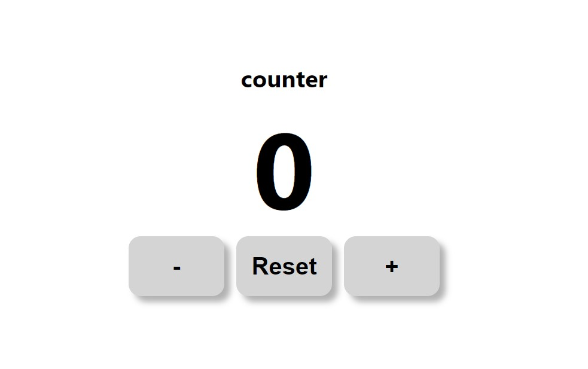
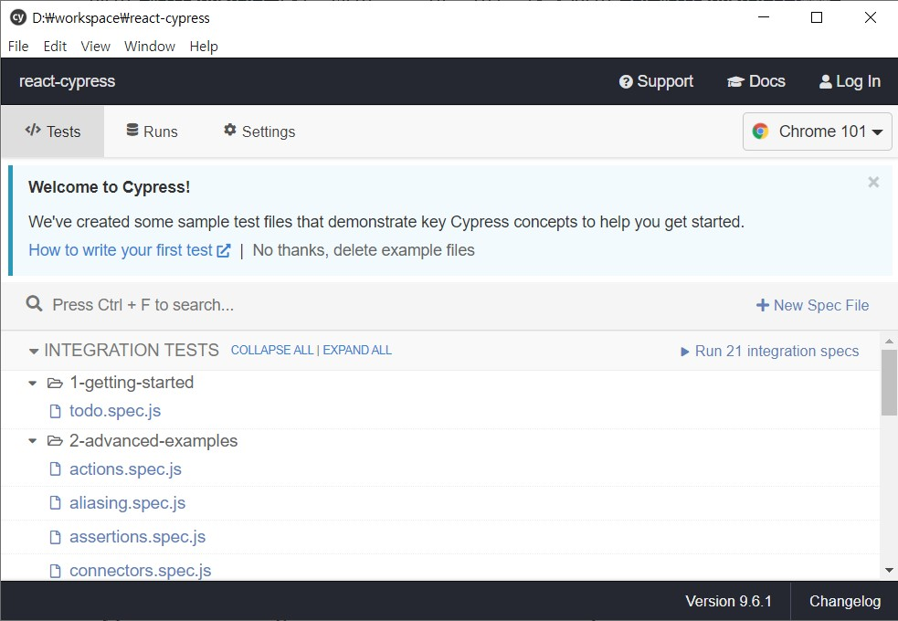
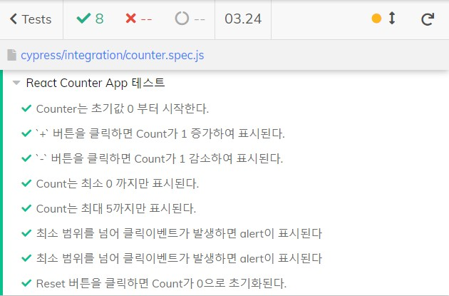
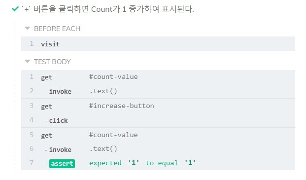

# react-cypress

Cypress를 이용한 React E2E테스트

본 프로젝트는 [blackcoffee-study/js-counter-test 레포지토리](https://github.com/blackcoffee-study/js-counter-test)를 기반으로 만들었습니다.

## Project

<p align="center">
  
  <a href="https://bb-choi.github.io/react-cypress/" target="_blank">🔗링크</a>
</p>

E2E 도구인 Cypress로 테스트를 수행해 보기 위한 간단한 Counter App

## 기능 명세

기능 명세대로 기능이 동작하는지 테스트합니다.

- [ ] Counter는 초기값 0 부터 시작한다.
- [ ] `+` 버튼을 클릭하면 Count가 1 증가하여 표시된다.
- [ ] `-` 버튼을 클릭하면 Count가 1 감소하여 표시된다.
- [ ] Count는 최소 0, 최대 5까지만 표시된다.
- [ ] 최소, 최대 범위를 넘어 클릭이벤트가 발생하면 alert이 표시된다.
- [ ] Reset 버튼을 클릭하면 Count가 0으로 초기화된다.

## Create React App을 통한 React App 생성

`npx create-react-app .` 으로 현재 디렉토리에 React App을 생성하여 진행한 프로젝트 입니다.

## Cypress 패키지 추가 및 실행

https://www.cypress.io/

dev dependency로 설치

```shell
npm install --save-dev cypress
```

실행

```shell
./node_modules/.bin/cypress open
```

첫 실행시에는 시간이 소요될 수 있다.



기본으로 설치된 샘플들을 확인하고, 테스트해 볼 수 있다.

파일명의 `.spec.js`는 이 제품의 사양(specification)이 어떻게 되는지 알려주는 테스트파일이라는 의미이다.

원하는 테스트파일을 클릭하여 테스트를 실행할 수 있다.

## 테스트 파일로 E2E 테스트하기

✅ [`test/cypress`](https://github.com/BB-choi/react-cypress/tree/test/cypress) 브랜치에서 확인([`./cypress/itegration/counter.spec.js`](https://github.com/BB-choi/react-cypress/blob/test/cypress/cypress/integration/counter.spec.js))이 가능합니다.



테스트가 올바르게 실행된 화면



상세 확인이 가능합니다.

✅ 이 레포지토리를 clone 하여 자유롭게 사용하셔도 됩니다.

---

## 참고 링크

- https://www.cypress.io/
- https://docs.cypress.io/api/commands/invoke
- https://docs.cypress.io/api/commands/stub
- https://365kim.tistory.com/74
- https://github.com/blackcoffee-study/js-counter-test
- https://tecoble.techcourse.co.kr/post/2021-07-28-react-cypress-testing/
